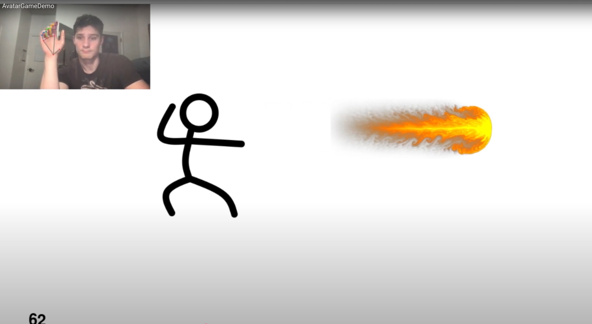

# AvatarGameDemo
This projects builds on hand segmentation technologies, such as Google's Mediapipe, to recognize hand poses in a fraction of a millisecond. The methodology deviates from traditional approaches that use cropped images fed into a CNN to classify images by exploring feature vectors composed of hand articulation points in conjunction with a relatively small MLP. This leads to faster training and inference times. Furthermore, the paper explores how to track poses through time and space and map them to predefined motions by subsampling the palm locations and comparing them against previously crafted score maps. Together, these technologies allow hand pose and motion to be tracked in real-time for gaming applications. [Download the Paper (PDF)](assets/AvatarGamePaper.pdf)

## How the Game Reads Hand Pose

Hand pose recognition is divided into two steps: 

1. **Extracting Joint Position Data**  
   Google’s [MediaPipe](https://ai.google.dev/edge/mediapipe/solutions/guide) hand-tracking detects a hand and outputs 21 3D landmarks representing key points on the hand.  
   
    <!-- Replace with actual figure -->

2. **Interpreting Pose from Data**  
   These 21 points are flattened into a 63-dimensional feature vector (x, y, z for each point) and passed into a 4-layer fully connected neural network. The model was trained on a modified version of the [ASL Alphabet Dataset](https://www.kaggle.com/datasets/debashishsau/aslamerican-sign-language-aplhabet-dataset), where:
   - The ASL sign for **X** was repurposed as **Fire**
   - The ASL sign for **E** was used as **Earth**
   - All other letters and miscellaneous hand poses were labeled **No Pose**

   To enhance model performance:
   - **Normalization and Augmentation** were applied
   - **Random 3D rotations** (up to 45° along any axis) improved robustness to orientation
   - **Loss function**: Weighted cross-entropy  
     - Fire: 2.0  
     - Earth: 2.0  
     - No Pose: 1.0  
   - **Optimizer**: Adam  
   - **Learning Rate Scheduler**: Multiplicative decay  

  This weighting strategy was designed to bias the model toward predicting elemental poses, aligning with the game’s interactive dynamics, where recognizing an elemental pose is more critical than identifying the absence of a pose, especially given the predominance of ”no pose” data in the training set.
    <!-- Replace with actual figure -->

---

## How the Game Tracks Hand Score Motion

While holding a pose, the game also evaluates the **motion path** traced by the user’s palm. It compares this motion to predefined gesture shapes using **score maps**.

### Score Maps

To create a score map:
1. A line drawing is binarized and resized
2. Gaussian blur is applied
3. The image is normalized and centered on its **center of mass (COM)**
4. All black pixels are converted to negative values, ensuring the total sum of the image is zero—penalizing extraneous motion

Examples of score maps:

 <!-- Replace with actual figure -->

### Normalizing Motion

To compare a user’s motion with the score maps:
1. Convert the user’s palm motion to a binary image
2. Crop and resize it while maintaining the aspect ratio
3. Align the motion's COM with that of the score map
4. Compute the score by **element-wise multiplication** of motion and score map
5. The highest score (above a threshold) determines the identified gesture

 <!-- Replace with actual figure -->

---

## Results

### Pose Classifier Accuracy

| Class  | Test Set Accuracy |
|--------|-------------------|
| Fire   | 0.9984            |
| Earth  | 0.9997            |
| Other  | 0.9997            |

### Score Map Results

| Shape     | Circle Score | Triangle Score | Move Three Score |
|-----------|--------------|----------------|------------------|
| Circle    | 1800         | -21            | 209              |
| Triangle  | 209          | 1474           | 312              |

